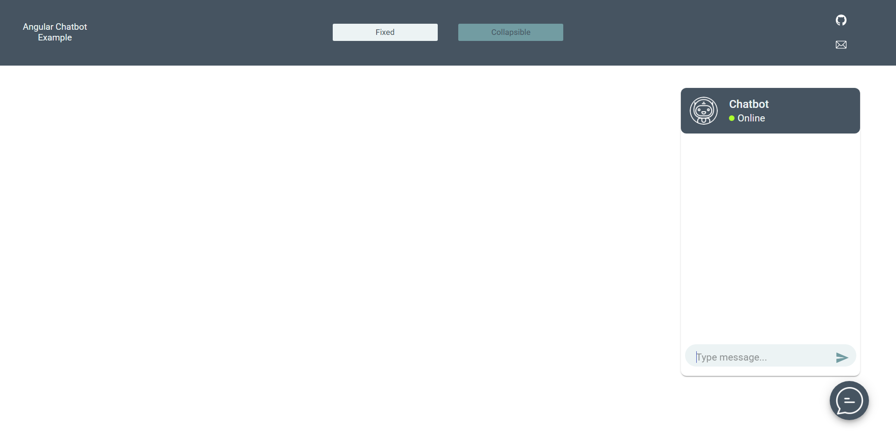

# AngularChatbot

An Angular Project for a Chatbot UI with integration with Googles's Dialogflow.

See demo: https://stackblitz.com/~/github.com/Abk8406/angular_chat_bot

## Development server

Run `ng serve` for a dev server. Navigate to `http://localhost:4200/`. The app will automatically reload if you change any of the source files.

## Build

Run `ng build --base-href angular-chatbot` to build the project. The build artifacts will be stored in the `dist/` directory. Use the `--prod` flag for a production build.

## Running unit tests

Run `ng test` to execute the unit tests via [Karma](https://karma-runner.github.io).

# Angular Chat Bot 🤖

This is an Angular-based chatbot UI integrated with OpenAI.

## 🚀 Features
- Real-time chat with OpenAI API
- Animated chat window
- User-friendly UI

## 🖥️ UI Preview


## 📦 Installation
```bash
git clone https://github.com/Abk8406/angular_chat_bot.git
cd angular_chat_bot
npm install
ng serve


